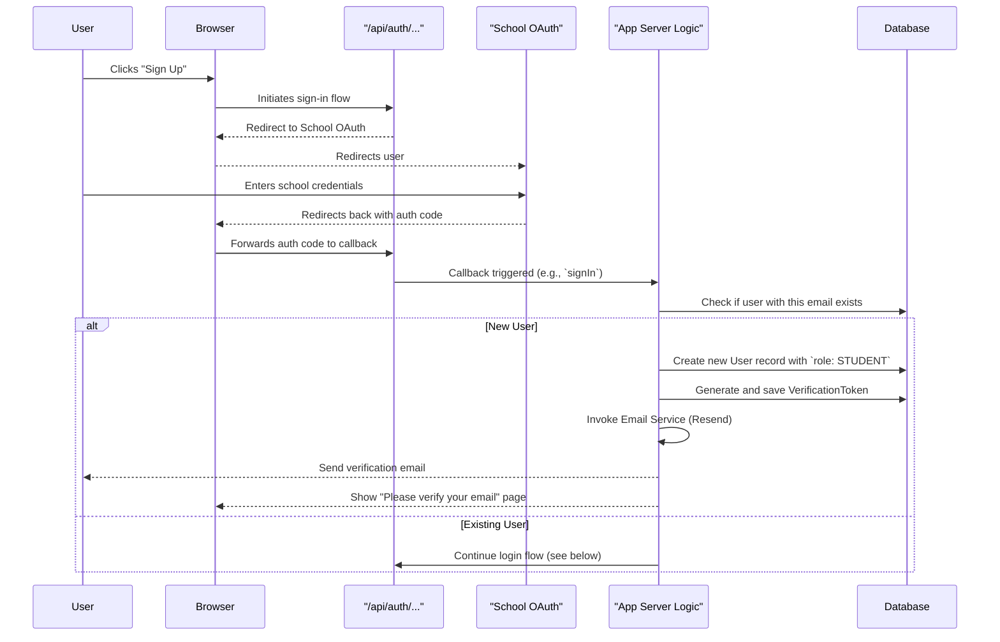
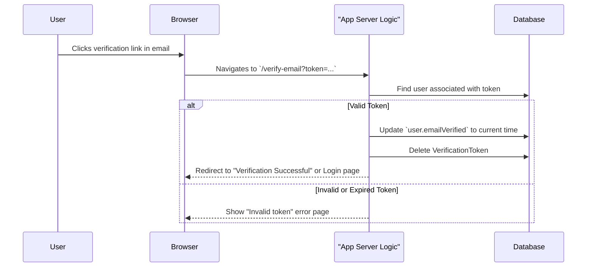
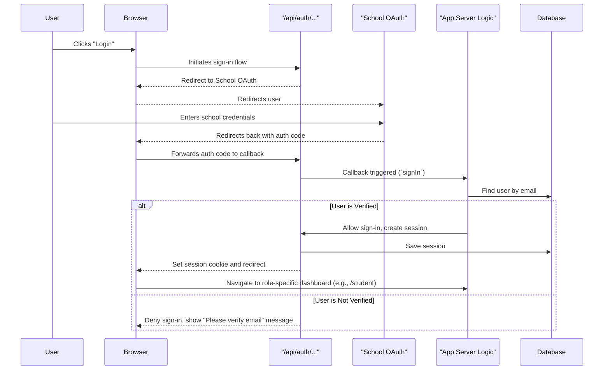

# Epic Technical Specification: Project Foundation & User Authentication

Date: 2025-11-28
Author: BIP
Epic ID: epic-1
Status: Draft

---

## Overview

This epic establishes the fundamental technical infrastructure for the Course-FAQ Chatbot, directly supporting the primary project goals of reducing teacher workload and enhancing student access to information. It includes setting up the project repository, configuring a CI/CD pipeline for automated testing and deployment, and creating the initial Supabase database schema.

A core part of this epic is implementing a robust and secure user authentication system using NextAuth.js and Supabase Auth. This will allow students and teachers to securely access the application using their school-issued OAuth 2.0 accounts, creating the trusted foundation upon which all subsequent features, from content management to chatbot interaction, will be built.

## Objectives and Scope

**In-Scope:**
*   **Repository Setup:** Initialize the Git repository using the T3 Stack starter template (`npm create t3-app@latest`).
*   **CI/CD Pipeline:** Configure a basic CI/CD pipeline on Vercel for automated builds, linting, and testing on every push to the main branch.
*   **User Registration & Authentication:** Implement the complete user authentication flow, including:
    *   User registration with a school email address.
    *   Email verification and account activation via a link sent by the Resend email service.
    *   Secure login using the school's OAuth 2.0 provider, managed by NextAuth.js.
*   **Role-Based Access Control (RBAC):**
    *   Create a `User` model in the Prisma schema with a `role` field (e.g., `STUDENT`, `TEACHER`).
    *   Differentiate user access based on their role after login, directing them to either the student-facing chatbot view or the teacher-facing admin view.
*   **Database Schema:** Define the initial `User` table in `schema.prisma`.

**Out-of-Scope:**
*   Any chatbot functionality (information retrieval, UI).
*   Integration with the Canvas LMS.
*   Teacher-specific content upload or management features.
*   Advanced AI features, multi-course support, or native applications as detailed in the PRD.

## System Architecture Alignment

This epic directly implements the foundational layers of the chosen T3 Stack architecture. The work aligns with the following key architectural decisions and components:

*   **Framework & API:** The project will be initialized with Next.js and tRPC, establishing the core application structure in the `src/` directory.
*   **Authentication:** User authentication will be handled by `NextAuth.js`, as specified in the architecture, with configuration located in `src/server/auth.ts`. This will integrate with Supabase Auth as the backend provider.
*   **Database:** The `User` model, essential for authentication and roles, will be defined in the Prisma schema (`prisma/schema.prisma`) and synchronized with the Supabase PostgreSQL database using `prisma db push`.
*   **Email Service:** The Resend email service will be integrated for sending account verification emails, as per the ADR.
*   **Deployment:** The entire application will be deployed to Vercel, leveraging its seamless integration with Next.js for CI/CD, as decided in the architecture plan.
*   **Epic to Architecture Mapping:** This work directly corresponds to the "Project Foundation & User Authentication" epic boundary defined in the architecture, utilizing components like `src/server/auth.ts`, Supabase Auth, and initial database models.

## Detailed Design

### Services and Modules

| Service / Module | Responsibilities | Inputs / Outputs | Owner |
|---|---|---|---|
| `src/server/auth.ts` | Configures NextAuth.js, defines OAuth providers (e.g., Google, school-specific), manages session/JWT callbacks, and handles user role assignment on sign-in. | **In:** ENV variables for provider secrets. <br/>**Out:** User session object for tRPC context. | Dev Team |
| `src/server/services/email.ts` | Encapsulates the Resend API client for sending transactional emails. Provides a simple interface for sending account verification and password reset emails. | **In:** User email address, verification token/URL. <br/>**Out:** API response from Resend. | Dev Team |
| `src/app/api/auth/[...nextauth]` | The Next.js route handlers that manage all authentication flows (sign-in, sign-out, callbacks, session management) as orchestrated by NextAuth.js. | **In:** OAuth provider redirect responses. <br/>**Out:** Session cookies, redirects. | Framework |

### Data Models and Contracts

The initial data model will be defined in `prisma/schema.prisma`. It will include the standard models required by the NextAuth.js Prisma adapter, plus a custom `Role` enum and an explicit role field on the `User` model.

```prisma
// prisma/schema.prisma

// Enum for Role-Based Access Control
enum Role {
  STUDENT
  TEACHER
}

// User model for authentication and role management
model User {
  id            String    @id @default(cuid())
  name          String?
  email         String?   @unique
  emailVerified DateTime?
  image         String?
  role          Role      @default(STUDENT)
  accounts      Account[]
  sessions      Session[]
}

// Standard NextAuth.js model for linking OAuth accounts
model Account {
  id                String  @id @default(cuid())
  userId            String
  type              String
  provider          String
  providerAccountId String
  refresh_token     String? @db.Text
  access_token      String? @db.Text
  expires_at        Int?
  token_type        String?
  scope             String?
  id_token          String? @db.Text
  session_state     String?

  user User @relation(fields: [userId], references: [id], onDelete: Cascade)

  @@unique([provider, providerAccountId])
}

// Standard NextAuth.js model for managing user sessions
model Session {
  id           String   @id @default(cuid())
  sessionToken String   @unique
  userId       String
  expires      DateTime
  user         User     @relation(fields: [userId], references: [id], onDelete: Cascade)
}

// Standard NextAuth.js model for email verification tokens
model VerificationToken {
  identifier String
  token      String   @unique
  expires    DateTime

  @@unique([identifier, token])
}
```

### APIs and Interfaces

As the project uses a tightly-coupled full-stack architecture, there are no traditional REST API endpoints for authentication. Instead, interfaces are provided through NextAuth.js routes and tRPC procedures.

### NextAuth.js API Routes
The `NextAuth.js` library automatically creates the required authentication routes under `/api/auth/`. These handle the entire OAuth 2.0 flow.
*   `/api/auth/signin`: Page to initiate the login process.
*   `/api/auth/signout`: Endpoint to log the user out.
*   `/api/auth/callback/[provider]`: The callback URL that the OAuth provider redirects to after a user authenticates.
*   `/api/auth/session`: Endpoint to retrieve the current user's session state.
*   `/api/auth/error`: Page to display authentication errors.

### tRPC API Procedures
A tRPC router will be created to expose session data to the frontend in a type-safe way.

**`src/server/api/routers/auth.ts`**
```typescript
import { createTRPCRouter, publicProcedure, protectedProcedure } from "../trpc";

export const authRouter = createTRPCRouter({
  // Public procedure to get the session, returns user object or null
  getSession: publicProcedure.query(({ ctx }) => {
    return ctx.session;
  }),

  // Example of a protected procedure that only authenticated users can call
  getSecretMessage: protectedProcedure.query(() => {
    return "you can now see this secret message!";
  }),
});
```

### Workflows and Sequencing

### 1. New User Registration & Verification Flow

This workflow describes the process for a new user authenticating for the first time.



### 2. Email Verification Flow



### 3. Existing User Login Flow

This workflow describes a returning user with a verified account.



## Non-Functional Requirements

### Performance

*   **Authentication Latency:** The end-to-end user login and session creation flow should complete in under 3 seconds on average.
*   **Static Asset Load:** Page loads for login and registration pages will be optimized by Vercel's global CDN, aiming for a Largest Contentful Paint (LCP) of less than 2.5 seconds.
*   **PRD Alignment:** While the primary performance NFR (NFR002: response time < 1 minute) applies to chatbot queries in a later epic, establishing a fast authentication experience is critical for user retention.

### Security

*   **Authentication (FR001):** All application access (beyond the login page) will be gated by NextAuth.js. A valid, active session linked to a verified user account is mandatory.
*   **Authorization (FR002, FR003, FR005):** Role-Based Access Control (RBAC) will be implemented. After login, user roles (`STUDENT` or `TEACHER`) will be used to authorize access to specific pages and API procedures. For example, access to the teacher dashboard will be denied for users with the `STUDENT` role. This will be enforced in Next.js middleware and/or protected tRPC procedures.
*   **Data Encryption (FR013, NFR003):** All data in transit between the client, Next.js server, and Supabase will be encrypted using TLS/HTTPS, which is automatically enforced by the Vercel and Supabase platforms.
*   **Data Privacy (FR014, NFR004):** The system will be designed to be stateless where possible and will not store any personal user information beyond what is essential for authentication (email, name, role), as defined in the Prisma schema. Session data is stored in a secure, HTTP-only cookie.
*   **Dependency Management:** Project dependencies will be regularly audited using `npm audit` to identify and mitigate known vulnerabilities.

### Reliability/Availability

*   **Availability (NFR001):** The application aims to meet the overall project uptime requirement of >90%. This is largely guaranteed by the underlying platforms.
*   **Platform Uptime:** The application's availability is dependent on Vercel and Supabase. Both platforms provide high-availability infrastructure with automatic scaling and failover.
*   **Degradation Behavior:** In the event of a dependent service outage (e.g., the school's OAuth provider or the Resend email service), the application will remain online but functionality will be gracefully degraded. Users will be presented with clear error messages indicating the service is temporarily unavailable. The core application status can be monitored independently of its dependencies.

### Observability

*   **Logging:** As per the architecture, structured JSON logging will be implemented on the server-side using `Pino`. Key authentication events such as successful login, failed login attempts, and account verification will be logged with a timestamp, level, and message. All server-side logs will be automatically captured and viewable within the Vercel dashboard.
*   **Metrics:** Basic application traffic, performance, and usage metrics will be monitored using the integrated Vercel Analytics service. No custom metrics are required for this epic.
*   **Tracing:** No specific distributed tracing solution will be implemented for this epic. Vercel provides some default tracing for its serverless function executions which can be used for basic debugging if needed.

## Dependencies and Integrations

This epic introduces the foundational dependencies for the project. No code will be written that depends on other epics.

### Key NPM Packages (from T3 Stack)
The project will be initialized with the T3 Stack, which includes these core dependencies:
*   `next`: `^14.0.0`
*   `react`: `^18.2.0`
*   `typescript`: `^5.3.0`
*   `@prisma/client`: `^5.7.0` (for database access)
*   `@trpc/client`, `@trpc/server`, `@trpc/react-query`: `^10.45.0` (for type-safe API)
*   `next-auth`: `^4.24.5` (for authentication)
*   `tailwindcss`: `^3.4.0` (for styling)

### External Service Integrations
*   **Supabase:** The application will integrate with Supabase for its PostgreSQL database and authentication backend. This is configured through environment variables and the Prisma schema.
    *   Library: `@supabase/supabase-js` (`^2.86.0`)
*   **Resend:** The Resend service will be used for sending the account verification email.
    *   Library: `resend` (`^6.5.2`)
*   **School OAuth Provider:** This is a configuration-based integration. The provider's endpoints and client credentials will be configured within `NextAuth.js` (`src/server/auth.ts`).

## Acceptance Criteria (Authoritative)

This section consolidates the acceptance criteria from all stories within Epic 1.

1.  A Git repository is initialized and configured with the T3 Stack template. (from Story 1.1)
2.  A basic CI/CD pipeline is set up on Vercel for automated builds and tests. (from Story 1.1)
3.  The default T3 "Hello World" page can be successfully deployed to a preview URL via the CI/CD pipeline. (from Story 1.1)
4.  All communication with the deployed application is encrypted via HTTPS. (from Story 1.1, FR013)
5.  The database schema is designed not to store unnecessary personal user information. (from Story 1.1, FR014)
6.  A user can initiate a login/registration flow using their school's OAuth 2.0 provider. (from Story 1.2, 1.4)
7.  The system sends a verification email to a new user's school email address upon first login attempt. (from Story 1.2)
8.  The verification email contains a unique, single-use link. (from Story 1.3)
9.  Clicking the verification link activates the user's account by updating the `emailVerified` status in the database. (from Story 1.3)
10. An unverified user account cannot complete the login process. (from Story 1.3)
11. A returning, verified user is successfully redirected to their designated dashboard after authenticating. (from Story 1.4)
12. A failed authentication attempt displays a clear error message to the user. (from Story 1.4)
13. The system correctly identifies a user's role (e.g., `STUDENT` or `TEACHER`) upon login. (from Story 1.5)
14. Users are redirected to a role-specific page (e.g., `/student/dashboard` or `/teacher/dashboard`) after login. (from Story 1.5)
15. A user with one role cannot access pages or API endpoints restricted to another role. (from Story 1.5)

## Traceability Mapping

| AC # | Spec Section(s) | Component(s)/API(s) | Test Idea |
| :--- | :--- | :--- | :--- |
| 1-3 | Dependencies, Workflows | T3 Init Command, Vercel | Run `npm create t3-app`, initialize a git repo, create a Vercel project, and verify the first deployment succeeds. |
| 4 | NFR (Security) | Vercel Deployment | Inspect the Vercel deployment URL in a browser to confirm it uses HTTPS. |
| 5 | NFR (Security), Data Models | `prisma/schema.prisma` | Review the `User` model in the Prisma schema to ensure no fields for storing sensitive personal data (beyond name/email) are present. |
| 6-7 | APIs/Interfaces, Workflows | NextAuth.js, Resend | For a new user, complete the OAuth flow and check the Resend dashboard to confirm a verification email was dispatched. |
| 8-9 | Workflows, Data Models | `VerificationToken` model | After a new user's first login, query the database for a `VerificationToken`. Click the link from the email and verify the `user.emailVerified` field is updated. |
| 10 | Workflows | NextAuth.js `signIn` callback | Write a unit/integration test for the `signIn` callback that mocks an unverified user and asserts that the callback returns `false`. |
| 11 | Workflows | NextAuth.js `signIn` callback | Write an E2E test (e.g., using Playwright) that logs in a verified user and asserts the browser URL is the correct dashboard page. |
| 12 | APIs/Interfaces | NextAuth.js UI | Manually test the login flow with incorrect credentials (if applicable) or simulate an OAuth error to ensure an error message is shown. |
| 13 | Data Models | `User.role`, Prisma Schema | Write a unit test for the user creation logic to ensure the default `role` is `STUDENT`. |
| 14-15| Workflows, RBAC | Next.js Middleware / tRPC | Write an integration test where a user with the `STUDENT` role attempts to access a protected tRPC procedure or page for teachers and assert that an `UNAUTHORIZED` error is returned. |

## Risks, Assumptions, Open Questions

*   **Risk:** The school's specific OAuth 2.0 provider has a non-standard implementation or poor documentation, complicating the NextAuth.js integration.
    *   **Mitigation:** Allocate specific time during Story 1.4 for discovery. If needed, be prepared to write a custom OAuth provider configuration for NextAuth.js.
*   **Assumption:** The selected T3 Stack and its core dependencies (Next.js, Prisma, tRPC) will remain stable and suitable for all project requirements without requiring major workarounds.
    *   **Mitigation:** The architecture was chosen for its strong alignment with project goals. The development team will monitor for any breaking changes in the ecosystem.
*   **Question:** What are the exact rate limits for the Resend email service's free tier, and are they sufficient for our development, testing, and initial launch phases?
    *   **Next Step:** The developer assigned to Story 1.2 must consult the official Resend documentation to confirm the sending limits (e.g., per day/hour) and ensure they align with our needs.
*   **Risk:** Management of environment variables (`.env`) for secrets across local, preview, and production environments becomes insecure or inconsistent.
    *   **Mitigation:** Strictly adhere to the T3 pattern of using a `.env.local` file (which is gitignored) for local development. All production and preview environment variables will be managed securely through the Vercel project dashboard. No secrets will ever be committed to the repository.

## Test Strategy Summary

The testing strategy for this foundational epic focuses on ensuring the core authentication and authorization mechanisms are robust and secure.

*   **Unit Tests:**
    *   **Frameworks:** Jest & React Testing Library.
    *   **Targets:** Any simple, non-trivial UI components created (e.g., a custom `SignOutButton` or a `PleaseVerify` message component). Logic within utility functions will also be unit tested.

*   **Integration Tests:**
    *   **Frameworks:** Jest, with testing utilities for tRPC and Prisma.
    *   **Targets:** This is the most critical testing level for this epic.
        1.  **NextAuth.js Callbacks:** Write tests for the `signIn` callback in `src/server/auth.ts` to validate the logic for new vs. existing users and verified vs. unverified accounts, mocking the database interaction.
        2.  **tRPC Procedures:** Test the RBAC implementation by writing integration tests for protected tRPC procedures, ensuring they return an `UNAUTHORIZED` error for users with incorrect roles.

*   **End-to-End (E2E) Tests:**
    *   **Framework:** Playwright or Cypress.
    *   **Targets:** A single, critical happy-path test will be created to cover the full user login flow:
        1.  Navigate to the application's home page.
        2.  Click the "Login" button.
        3.  Mock the OAuth provider interaction to simulate a successful login.
        4.  Assert that the user is redirected to the correct role-based dashboard.

*   **Manual Testing:** All pull requests will generate a Vercel preview deployment. Manual verification of the implemented user flows will be conducted on these preview deployments before merging to the `main` branch.
